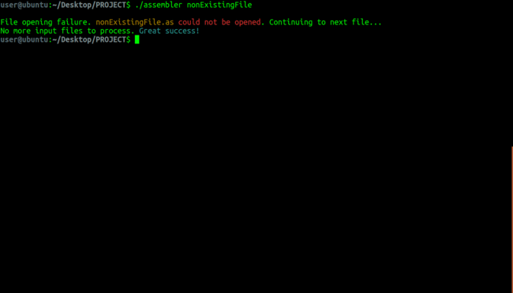

<h1 align="center">Two Pass Assembler</h1>

  
   
  <i>Terminal output of the two pass assembler.</i>

## About

This two pass assembler was written for an [imaginary computer](#computer-and-language-structure) as a final project of the course *[20465 - Systems Programming in C](https://openu.ac.il/courses/20465.htm)* (full assignment details [here](readme/assignment.pdf)).

The project was written in collaboration with [@yuzev](https://github.com/yuzev).

## Usage

1. Run `make`
2. Run `./assembler yourFileName.as`

The assembler will output *.ent*, *.ext* and *.ob* files. 

## Files Structure

- Assembler files:

    - `assembler.c` - Main program.

    - `first_pass.c` - An implementation of first pass algorithm.

    - `parser.c` - Parses each line from the input *.as* file as part of `first_pass.c`.

    - `first_analyze.c` - Analyzes the line after it has been parsed by `parser.c`. This is the execution of `first_pass.c`.

    - `second_pass.c` - An implementation of second pass algorithm.

    - `errors.c` - A thorough check of errors during first and second pass.
    
    - `output.c` - Creates *.ext*, *.ent* and *.ob* output files.

- Data Structures

    - `line_data_structure` - Represents a line read from input *.as* file after it was parsed and analyzed.

    - `linked_list_data_structure` - Linked list implementation. Used to represent Symbol Table, Image Code and Image Data of the assembler.

    - `binary_data_structure` - Representation of machine word in binary.

- Helpers and utils

    - `assembler_helpers.c` - main program helpers to free data structures and check arguments validity.

    - `constants.h` - Implementation of boolean values, program colors and constants.

    - `utils.c` - General program helpers (validates malloc, succesfull fopen/fclose etc).

    - `str_handling.c` - String functions and manipulation.

## Computer and Language Structure

### Computer Structure
Our imaginary computer consists of CPU, Registers and RAM (some of the RAM is utilized as stack).

The CPU has 8 registers (r0-r7). each register size is 12 bits. lsb is 0 and msb is 11.

The CPU has a register named PSW which contains flags regarding computer status in each moment.

Memory size is 4096 and each memory cell size is 12 bits.

The computer works only with Integers.

### Word and Sentence Structure

Each computer instruction consists between 1 to 3 words which are encoded in the following manner:

| 0 | 1 | 2 | 3 | 4 | 5 | 6 | 7 | 8 | 9 | 10 | 11 |
|---|---|---|---|---|---|---|---|---|---|---|---|
|  origin | origin  |  destination | destination  | funct | funct | funct | funct | opcode | opcode | opcode | opcode |

The assembler consists of 16 actions, each of them consists a different funct and opcode (*mov, cmp, add, sub, lea, clr, not, inc, dec, jmp, bne, jsr, red, prn, rts and stop*).

There are 4 kinds of sentences the assembler knows:

1. Empty Sentence - A line contains only whitespaces.

2. Comment Sentence - A line that starts with `;`.

3. Instruction Sentence - Variables assignment and declaration.

4. Command Sentence - Creates an action for the machine to execute upon running the program.

Line maximum length is 80. 

Usage of labels is optional. A label is any word (reserved words not allowed) which is declared at the beginning of the sentence and ends with `:`. For example `myLabel:`.

#### Instruction Sentence

Instruction Sentence may or may not start with a label. Valid instructions are: 

1. **.data** - declaration of integers. For example: `.data 12, 453, -6`.

2. **.string** - declaration of a string contained within *" "*. For example: `.string "OH MY GOD!"`.

3. **.extern** - reference to an external label, declared in another file. For example `.extern myLabel`.

4. **.entry** - reference to an internal label, that already was or will be declared in the program. For example `.entry myLabel`.

#### Command Sentence

Command Sentence may or may not start with a label. Valid commands are: 

**mov** - copies origin operand to destination

**cmp** - performs comparison between 2 operands

**add** - destination operand receives the addition result of origin and destination

**lea** - load effective address

**clr** - clears operand

**not** - logical not, reverses all bits in operand

**inc** - increments operand's content by 1

**dec** - decrements operand's content by 1

**jmp** - jumps to instruction in destination operand

**bne** - branch if not equal to zero

**jsr** - calls a subroutine

**red** - reads a char from stdin

**prn** - prints char into stdout

**rts** - returns from subroutine

**stop** - stops the program

## The Two Pass Algorithm

When the assembler receives input in assembly language, it has to go over the input 2 times. The reason for that is the references to instructions which still has unknown addresses during first pass.

The assembler has 2 linked lists representing the Image Code and Image Data and another linked list representing the Symbol Table.

Symbol Table - will be updated during first pass with the addresses of the instructions.

Image Code - represents machine code of all the command sentences.

Image Data - represents machine code of all the instruction sentences.

Using an instruction counter, each instruction is being added to the counter, ensuring the next instruction will be assigned to free memory space.
  
At first pass, the symbols (labels) in the program are recognized and are assigned a unique number representation in the memory.

At second pass, using the symbol values, the machine code is built. The instruction's addresses are updated from the symbol table.

If any errors are found during first pass (and second), the program will continue to the next file.